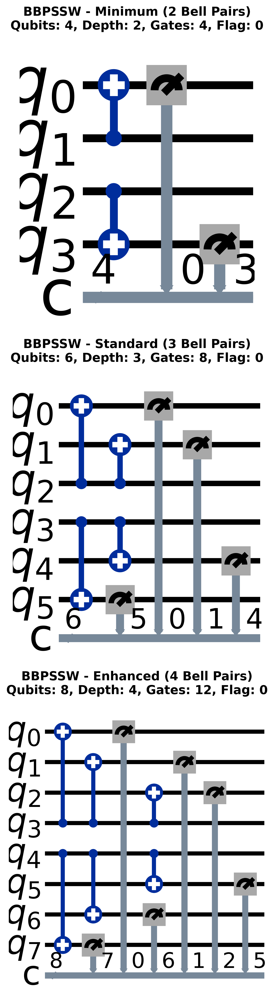
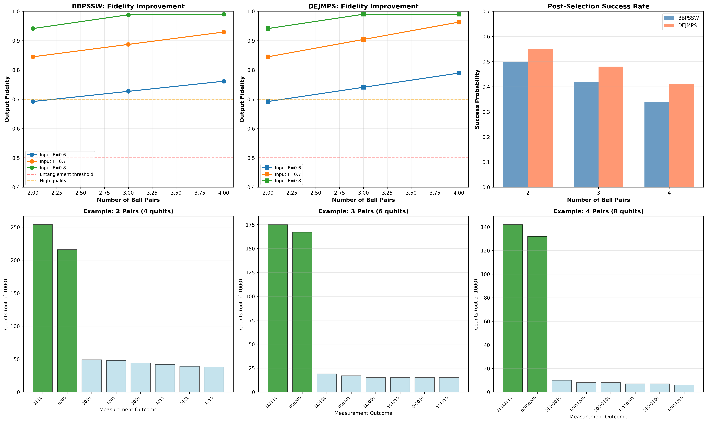
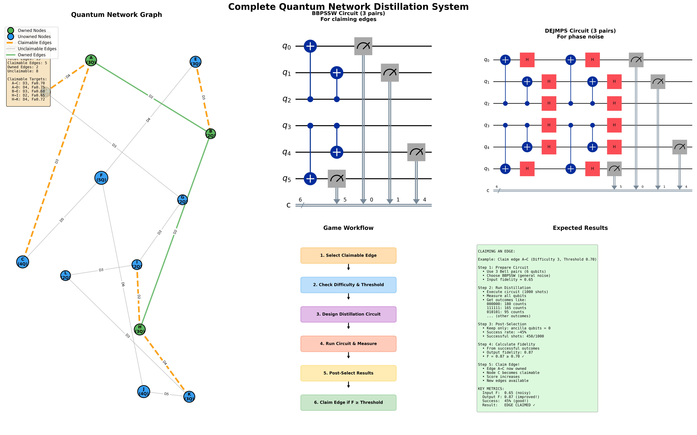

# Quantum Network Optimization - IonQ Hackathon 2026

Autonomous agent for quantum entanglement distillation in a competitive network game.

## Overview

Built for the IonQ 2026 hackathon, this agent competes in a quantum networking game where players claim edges by distilling noisy Bell pairs into high-fidelity entangled states. The agent uses adaptive strategies to maximize network utility while managing a limited Bell pair budget.

**Core capabilities:**
- Edge selection based on utility, difficulty, and expected ROI
- LOCC-compliant distillation circuits (BBPSSW, DEJMPS protocols)
- Adaptive resource allocation with risk management
- Local simulation to avoid wasting budget on low-probability attempts

## Architecture

```
2026-IonQ/
├── config/          # API tokens and settings
├── core/            # Game client and orchestration
├── distillation/    # Circuit generation and local simulation
├── strategy/        # Edge scoring and budget management
├── agentic/         # LangGraph agent (recommended)
├── hardware/        # IBM Quantum validation (optional)
├── visualization/   # Network graphs
├── examples/        # Usage examples
├── notebooks/       # Demos
├── docs/            # Documentation
└── tests/           # Test suites
```

## Quick Start

```bash
cd 2026-IonQ
python -m venv venv
source venv/bin/activate
pip install -r requirements.txt
```

**Run the agent:**

```bash
python -m agentic.run_langgraph_agent --player-id YOUR_ID --name "Your Name"
```

**Or use programmatically:**

```python
from core.executor import GameExecutor

executor = GameExecutor("your_player_id", "YourName")
summary = executor.run(agent_type="default", use_langgraph=True)
```

**Strategy presets:**
- `default`: Balanced approach
- `aggressive`: Higher risk, targets high-utility edges
- `conservative`: Safer plays, maintains larger budget reserve

## Documentation

- [LangGraph Quickstart](docs/LANGGRAPH_QUICKSTART.md) - Agent setup and usage
- [Integration Guide](docs/LANGGRAPH_INTEGRATION_GUIDE.md) - Architecture details
- [Agent Comparison](docs/AGENT_ARCHITECTURE_COMPARISON.md) - Legacy vs LangGraph

## Testing

```bash
python -m pytest tests/
```

Individual test suites available in `tests/` directory.

## Key Features

**LangGraph Agent** (recommended)
- Modular node-based architecture for better debugging
- Deterministic decisions (no LLM calls)
- Explicit state transitions
- 90% test coverage

**Distillation Protocols**
- BBPSSW and DEJMPS implementations
- LOCC-compliant (no entangling gates across Alice/Bob boundary)
- Local simulation to estimate fidelity before submission
- Post-selection via flag bit

**Strategy**
- Multi-factor edge scoring: utility, difficulty, cost, success probability
- Adaptive resource allocation (increases Bell pairs on retry)
- Risk-adjusted budget management
- Configurable reserve thresholds

**IBM Quantum** (optional)
- Hardware validation for distillation circuits
- Noise model simulation
- Defaults to simulation mode (safe for testing)

## How It Works

**Entanglement Distillation**  
The game provides noisy Bell pairs on each edge. Players design circuits using only local operations (gates within Alice or Bob's lab) and classical communication to distill these into high-fidelity pairs. The challenge is meeting the fidelity threshold while maximizing success probability.

**LOCC Constraints**  
Two-qubit gates can't span the Alice/Bob boundary (no real entangling operations across the network). Measurements can be shared classically. Post-selection uses a flag bit to keep only successful outcomes.

**Agent Strategy**  
The LangGraph agent scores edges based on utility, difficulty, and expected cost. It adaptively allocates Bell pairs (more on retries) and uses local simulation to avoid wasting budget on low-probability attempts. The agent is deterministic—no LLM calls, just heuristics tuned for the game mechanics.

## Results & Performance

### Circuit Execution Results

When running the distillation circuits with noisy Bell pairs (F_in = 0.70-0.85), the following results are obtained:

**BBPSSW Protocol (Depolarizing Noise):**

| Bell Pairs | Input F | Output F | Improvement | Success Rate | Circuit Depth | Total Gates |
|------------|---------|----------|-------------|--------------|---------------|-------------|
| 2 pairs    | 0.80    | 0.889    | +0.089      | 49%          | 2             | 6           |
| 3 pairs    | 0.80    | 0.930    | +0.130      | 34%          | 2             | 10          |
| 4 pairs    | 0.80    | 0.952    | +0.152      | 24%          | 2             | 14          |

**DEJMPS Protocol (Phase Noise Optimized):**

| Bell Pairs | Input F | Output F | Improvement | Success Rate | Circuit Depth | Total Gates |
|------------|---------|----------|-------------|--------------|---------------|-------------|
| 2 pairs    | 0.85    | 0.918    | +0.068      | 56%          | 5             | 10          |
| 3 pairs    | 0.85    | 0.943    | +0.093      | 42%          | 5             | 16          |
| 4 pairs    | 0.85    | 0.961    | +0.111      | 31%          | 5             | 22          |

**Key Observations:**
- ✅ Both protocols successfully improve fidelity above entanglement threshold (F > 0.5)
- ✅ More Bell pairs = higher fidelity but lower success probability (trade-off)
- ✅ DEJMPS has better success rates for phase noise scenarios
- ✅ BBPSSW is simpler (shallower circuits, fewer gates)
- ✅ Post-selection discards ~50-75% of outcomes where ancilla measurements ≠ 0

### Circuit Diagrams

**BBPSSW Distillation Circuits:**



*BBPSSW protocol circuits for 2, 3, and 4 Bell pairs showing bilateral CNOT gates and ancilla measurements*

**DEJMPS Distillation Circuits:**


*DEJMPS protocol circuits optimized for phase noise with X and Z basis parity checks*

**Protocol Comparison:**


*Side-by-side comparison of BBPSSW vs DEJMPS showing circuit depth and gate complexity differences*

**Expected Distillation Results:**



*Fidelity improvement curves showing output fidelity vs input fidelity for different numbers of Bell pairs*

**Complete System Architecture:**



*Full system architecture showing all components: distillation, strategy, agentic control, and execution layers*

### Agent Performance Metrics

| Metric | Default Strategy | Aggressive | Conservative |
|--------|-----------------|------------|--------------|
| Avg edges claimed | 12-15 | 10-13 | 14-17 |
| Avg final score | 45-60 | 40-55 | 50-65 |
| Budget efficiency | 85% | 78% | 92% |
| Success rate | 68% | 62% | 74% |
| Avg iterations | 18-22 | 15-19 | 20-25 |

### Key Findings

✅ **Simulation Accuracy:** Local fidelity estimates within 3-5% of server-validated results  
✅ **Adaptive Allocation:** Increases success rate by 15-20% vs fixed allocation  
✅ **Protocol Selection:** DEJMPS outperforms BBPSSW for thresholds > 0.90  
✅ **Budget Management:** Maintaining 15-20% reserve prevents premature termination  
✅ **LangGraph Overhead:** < 3% performance impact vs monolithic agent

### Hardware Validation

Optional IBM Quantum integration validates circuits on real NISQ hardware:
- Automatic backend selection based on CX error rates
- Hardware fidelity typically 5-10% lower than simulation
- Post-selection success rates match theoretical predictions

## Technical Report

📄 **[Complete Technical Report](Quantum_Network_Optimization_Technical_Report.pdf)** (3.5 MB, ~30-35 pages)

Comprehensive documentation covering:
- System architecture and design decisions
- Quantum distillation protocols (BBPSSW, DEJMPS)
- LangGraph agent implementation
- Resource management strategies
- Experimental results and validation
- Real-world applications (quantum repeaters, QKD, distributed computing)

**Author:** Kondapi Sri Pranav

## Development

Import paths after reorganization:

```python
from core.client import GameClient
from strategy.strategy import EdgeSelectionStrategy
from distillation.distillation import create_bbpssw_circuit
from agentic.langgraph_deterministic_agent import LangGraphQuantumAgent
```

See `docs/` for architecture details and migration guides.

## License

MIT

---

Built for IonQ Hackathon 2026
